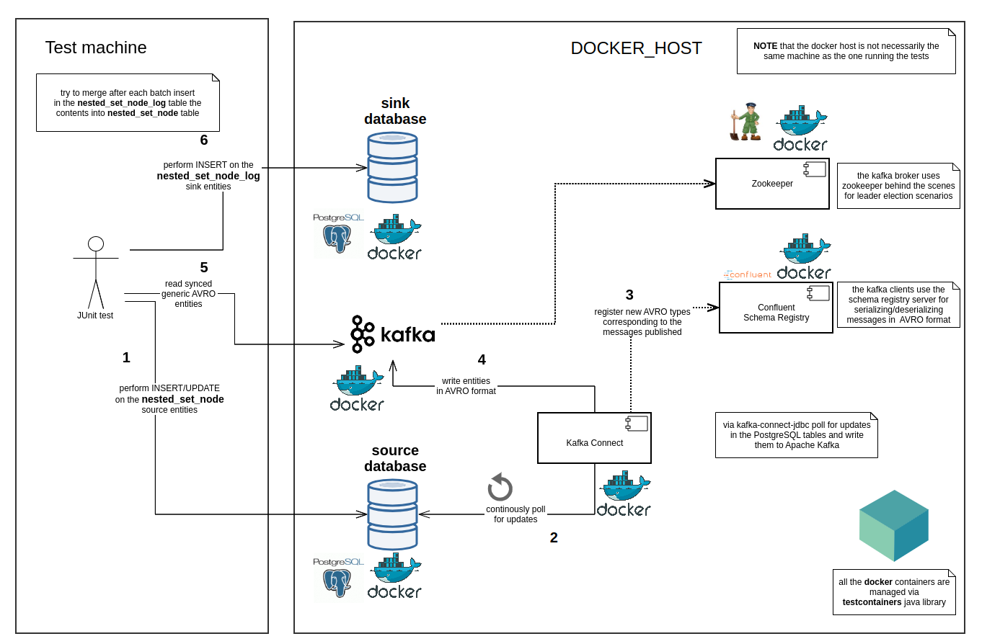

Sync hierarchical data between relational databases over Apache Kafka
=====================================================================

This is a proof of concept on how to *eventually* sync hierachical data 
from a source database towards a sink database via Apache Kafka in an
untainted fashion without intermittently having corrupt content on the sink
database.

## Nested Set Model

There are multiple ways of storing and reading hierarchies in a relational database:

- adjacency list model: each tuple has a parent id pointing to its parent
- nested set model: each tuple has `left` and `right` coordinates corresponding to the preordered representation of the tree

Details about the advantages of the nested set model are already very well described in
the following article:

https://www.sitepoint.com/hierarchical-data-database/


**TLDR** As mentioned on [Wikipedia](https://en.wikipedia.org/wiki/Nested_set_model)

> The nested set model is a technique for representing nested sets 
> (also known as trees or hierarchies) in relational databases.


## Syncing nested set models over Apache Kafka

[Kafka Connect](https://docs.confluent.io/current/connect/index.html)
is an open source component of [Apache Kafka](http://kafka.apache.org/) which
in a nutshell, as described on [Confluent blog](https://www.confluent.io/blog/kafka-connect-deep-dive-jdbc-source-connector/) 
provides the following functionality for databases:

> It enables you to pull data (source) from a database into Kafka, and to push data (sink) from a Kafka topic to a database. 


More details about kafka-connect-jdbc connector can be found on the
[Conflent documentation](https://docs.confluent.io/current/connect/kafka-connect-jdbc/index.html).


Syncing of nested set model from the source database to Apache Kafka
can be easily taken care of by a kafka-connect-jdbc source connector
which can be initialized by posting the following configuration 
to the `/connectors` endpoint of
Kafka Connect (see [Kafka Connect REST interface](https://docs.confluent.io/current/connect/references/restapi.html#post--connectors))

```json
{
    "name": "findinpath",
    "config": {
        "connector.class": "io.confluent.connect.jdbc.JdbcSourceConnector",
        "mode": "timestamp+incrementing",
        "timestamp.column.name": "updated",
        "incrementing.column.name": "id",
        "topic.prefix": "findinpath.",
        "connection.user": "sa",
        "connection.password": "p@ssw0rd!source",
        "validate.non.null": "false",
        "tasks.max": "1",
        "name": "findinpath",
        "connection.url": "jdbc:postgresql://source:5432/source?loggerLevel=OFF",
        "table.whitelist": "nested_set_node"
    }
}
```

**NOTE** in the configuration above, the `tasks.max` is set to `1` because JDBC source connectors can deal
only with one `SELECT` statement at a time for retrieving the updates performed on a table.
It is advisable to use also for Apache Kafka a topic with only `1` partition for syncing the nested set content
towards downstream services.

### Refresh the nested set model on the sink database

On the sink database side there needs to be implemented a mechanism that contains
a safeguard for not adding invalid updates to the nested set model.
A concrete example in this direction is when going from the nested set model:

```
|1| A |2|
```

to the nested set model (after adding two children)

```
|1| A |6|
    ├── |2| B |3|
    └── |4| C |5|
```

In the snippets above the tree node labels are prefixed by their `left` and `right`
nested set model coordinates.

Via `kafka-connect-jdbc` the records corresponding to the tuple updates may come in various
ordering:

```
| label | left | right |
|-------|------|-------|
| A     | 1    | 6     |
| B     | 2    | 3     |
| C     | 4    | 5     |
```
or
```
| label | left | right |
|-------|------|-------|
| B     | 2    | 3     |
| C     | 4    | 5     |
| A     | 1    | 6     |
```
or any other combinations of the three tuples listed above because the records
are polled in batches of different sizes from Apache Kafka. 


Going from the nested set model table content

```
| label | left | right |
|-------|------|-------|
| A     | 1    | 2     |
```
towards

```
| label | left | right |
|-------|------|-------|
| A     | 1    | 6     |
```

or 
 
```
| label | left | right |
|-------|------|-------|
| A     | 1    | 6     |
| B     | 2    | 3     |
```

would intermittently render the nested set model corrupt until
all the records from the source nested set model are synced over Apache Kafka.

Using a kafka-connect-jdbc sink connector is therefor out of the question for
syncing the contents of trees from a source service towards downstream online services.  

One solution to cope with such a problem would be to separate the nested set model from 
what is synced over Apache Kafka. 


In the table diagram above, the `nested_set_node_log` table is an `INSERT only` table
in which is written whenever a new record(s) is read from Apache Kafka.
The `log_offset` table has only one tuple pointing to the last `nested_set_node_log` tuple id
processed when updating the `nested_set_node` table.

Whenever new records are read from Apache Kafka, there will be a transactional attempt 
to apply all the updates from `nested_set_node_log` made after the saved entry in the `log_offset`
table to the existing configuration of the `nested_set_node` nested set model.

If the applied updates lead to a valid nested set model configuration, then the `nested_set_node`
table will be updated and the log offset will be set to the latest processed `nested_set_node_log` entry.
Otherwise the `nested_set_node` table stays in its previous state. 

## Caching

On the sink side is implemented the [Guava's Cache](https://github.com/google/guava/wiki/CachesExplained)
for avoiding to read each time from the persistence the contents of the nested set model.
This approach nears the usage on a productive system, where the contents of the nested set model
are cached and not read from the database for each usage.

When there are new contents added to the nested set model, the cache is notified for 
invalidating its contents. 

## JDBC Transactions

One of the challenges faced before implementing this proof of concept
was whether to use [spring framework](https://spring.io/) to wrap the 
complexities of dealing with JDBC. It is extremely appealing to use
production ready frameworks and not care about their implementation complexity.

The decision made in the implementation was to avoid using `spring` and
`JPA` and go with plain old `JDBC`.

Along the way in the implementation, one open question was whether to group
all the JDBC complexity in one repository or in multiple repositories.
Due to the fact that multiple repositories bring a better overview in the
maintenance, the decision was made to go with multiple repositories.

There were some scenarios which involved transaction handling over multiple
DAO objects. The possible ways of handling transactions over multiple repositories is very
well described in the stackexchange post:

https://softwareengineering.stackexchange.com/a/339458/363485

The solution used to cope with this situation within this proof of concept was to create
repositories for each service operation and inject  the connection in the repositories.

> Dependency injection of connection: Your DAOs are not singletons but throw-away objects, receiving the connection on creation time. The calling code will control the connection creation for you.
>
> PRO: easy to implement
>
> CON: DB connection preparation / error handling in the business layer
>
> CON: DAOs are not singletons and you produce a lot of trash on the heap (your implementation language may vary here)
>
> CON: Will not allow stacking of service methods


## Testing

It is relatively easy to think about a solution for the previously exposed problem, but before putting it to a production
environment the solution needs propper testing in conditions similar to the environment in which it will run.

This is where the [testcontainers](https://www.testcontainers.org/) library helps a great deal by providing lightweight, 
throwaway instances of common databases that can run in a Docker container.



Docker containers are used for interacting with the Apache Kafka ecosystem as well as the source and sink databases.

This leads to tests that are easy to read and allow the testing of the sync operation for various nested set models

```java
    /**
     * This test ensures the sync accuracy for the following simple tree:
     *
     * <pre>
     * |1| A |6|
     *     ├── |2| B |3|
     *     └── |4| C |5|
     * </pre>
     */
    @Test
    public void simpleTreeDemo() {
        var aNodeId = sourceNestedSetService.insertRootNode("A");
        var bNodeId = sourceNestedSetService.insertNode("B", aNodeId);
        var cNodeId = sourceNestedSetService.insertNode("C", aNodeId);

        awaitForTheSyncOfTheNode(cNodeId);
        logSinkTreeContent();
    }
``` 

This project provides a functional prototype on how to setup the whole
Confluent environment (including **Confluent Schema Registry** and **Apache Kafka Connect**) 
via testcontainers.

See [AbstractNestedSetSyncTest](end-to-end-tests/src/test/java/com/findinpath/AbstractNestedSetSyncTest.java) 
and the [testcontainers package](end-to-end-tests/src/test/java/com/findinpath/testcontainers) for details.

### Kafka Connect

In order to use the Confluent's Kafka Connect container, this project made use of the already existing code
for [KafkaConnectContainer](https://github.com/ydespreaux/testcontainers/blob/master/testcontainers-kafka/src/main/java/com/github/ydespreaux/testcontainers/kafka/containers/KafkaConnectContainer.java)
on [ydespreaux](https://github.com/ydespreaux) Github account.

**NOTE** that the `KafkaConnectContainer` class previously mentioned has also corresponding test cases 
within the project [lib-kafka-connect](https://github.com/ydespreaux/shared/tree/master/lib-kafka-connect) in order to have a clue
on how to interact in an integration test with the container.  